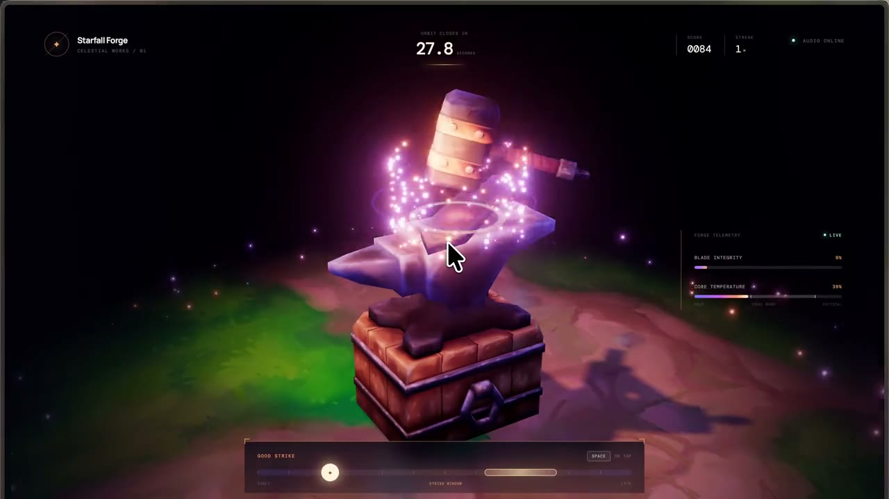

# Starfall Forge

A small WebGPU timing and heat-management game about forging a blade from a fallen star.

[Play Starfall Forge](https://aps4087.github.io/starfall-forge/)

## Forge run

[](./media/starfall-forge-demo.mp4)

_Click the preview for the short, optimized video._

## Play

```bash
npm install
npm run dev
```

Press <kbd>Space</kbd> or tap the scene when the moving comet is inside the golden strike window. Accurate, well-paced hits form the blade. Hitting too quickly overheats it and breaks the streak.

## A learning experience

Starfall Forge is a non-commercial learning experiment created after working through Bruno Simon's [WebGPU & TSL — Anvil lesson](https://threejs-journey.com/lessons/webgpu-tsl/anvil) in the [Three.js Journey WebGPU & TSL course](https://threejs-journey.com/webgpu-tsl). It is an original game built to practise the lesson's ideas—not official Three.js Journey course material.

The project turns those techniques into a different interactive loop: timing, heat management, combos, progression and a short win-or-lose run. Huge thanks to [Bruno Simon](https://bruno-simon.com/) for creating the course and teaching the underlying techniques.

## What changed from the lesson

The lesson's demo becomes a 30-second game with:

- a moving timing target that gets narrower as the blade is formed;
- heat management that rewards rhythm and punishes button-mashing;
- score, streak, progress, win/lose states and a saved personal best;
- procedural Web Audio impacts, camera shake and an expanding shockwave;
- a TSL-powered celestial sigil that reveals itself with game progress;
- responsive mouse, keyboard and touch controls.

## Learning map

| Lesson idea | Where it appears here | Why it matters to the game |
| --- | --- | --- |
| Code-native scene parts | `hammer`, `blade` and `forge` in `src/script.js` | Keeps gameplay pieces directly animatable and the public project self-contained. |
| TSL emissive heat field | `blade.material.emissiveNode` | Heat and impact position become visible on the blade. |
| Animated point light | `impactLight` | Gives each strike immediate physical presence. |
| Storage buffers + compute | `sparkExplosion` and `sparkUpdate` | Thousands of bouncing sparks remain practical. |
| Frame-rate-independent easing | the animation loop | Smoothly settles the hammer, light, heat and progress. |
| Render pipeline + bloom | `bloomPass` | Makes hot metal, sparks and sigils feel luminous. |

The most useful experiment is changing one system at a time: the timing window, heat gain/cooling, spark velocity, emissive colors, then bloom strength. That makes the relationship between game feel and rendering very obvious.

## Project structure

```text
src/index.html   interface and game screens
src/style.css    layout, HUD and responsive states
src/script.js    procedural scene, TSL effects and game loop
media/           optimized README demo and poster
```

### Asset note

All visuals in this public version—including the forge, hammer, blade, floor and celestial details—are generated from original Three.js geometry and materials in `src/script.js`. No model, texture, image, video or other asset from the paid course is redistributed here.

## License

The original project code and media are available under the [MIT License](./LICENSE). Three.js Journey and its course material remain the property of their respective rights holders.
